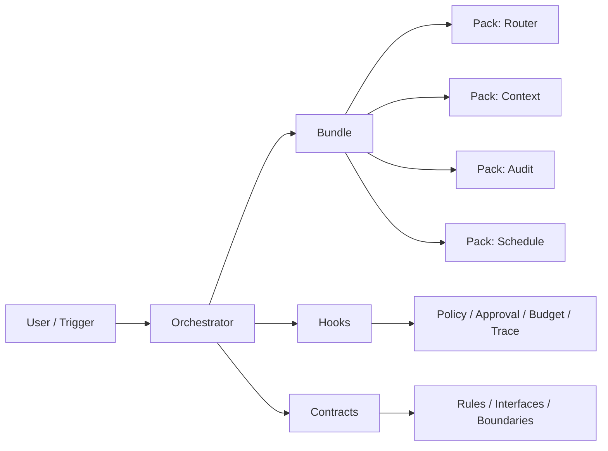

# OpenClaw Skeletons

面向 AI Agent 的**可插拔数字员工骨架系统**。

它不解决某一个单点能力，而是把 **Pack / Bundle / Orchestrator / Contracts / Hooks** 组织成一套可运行、可治理、可审计的常驻系统。

> 不是 demo，不是一次性 workflow。
> 是能长期在线、可替换、可扩展的数字员工基础设施。

---

## 一眼看懂



OpenClaw 把 AI work 放进同一套操作面里：

- **Board**：编排任务与协作流转
- **Table**：批量管理对象、状态和运营动作
- **Timeline**：查看执行链路、审计记录和复盘过程
- **Docs**：沉淀规则、上下文、SOP 和讨论
- **Dashboard**：监控结果、预算、成功率与系统健康度

它们不是五个拼起来的页面，而是**同一套系统在不同操作尺度下的视图**。

---

## 核心理念

### 什么是数字员工骨架？

如果把 agent 当成员工来运营，系统至少要解决五件事：

- 职责边界：什么该做，什么不该做
- 工作手册：遇到什么情况怎么处理
- 治理干预：谁能审批、谁能中断、谁能审计
- 运行记录：做了什么、怎么做的、结果如何
- 替换能力：做不好可以换 Pack、换 Bundle、换 Orchestrator

**数字员工骨架，就是把这些能力拆成稳定的组织层次：**

- **Pack** = 手艺
- **Bundle** = 工种
- **Orchestrator** = 组织方式
- **Contracts** = 规章制度
- **Hooks** = 治理插槽

### 为什么需要骨架？

**没有骨架的 AI Agent：**
```text
用户: "帮我发个邮件"
Agent: 直接发
→ 不知道发给谁
→ 不知道说什么
→ 发了也不知道发没发成功
→ 不能审计，也不能回滚
```

**有骨架的 AI Agent：**
```text
用户: "帮我发个邮件"
Agent:
  1. 检查权限（runtime hook 拦截）
  2. 加载上下文（Context Preloader）
  3. 路由到正确 skill（Skill Router）
  4. 执行并记录（Audit Trail）
  5. 返回结果（标准化输出）
→ 可控、可审计、可回滚、可替换
```

### 我们押注什么

我们不把未来绑定在某一个框架名字上，而是押注这些长期有效的工程范式：

- Skill
- MCP
- CLI
- Hook
- Cron

这些范式会长期存在，骨架也应该长期兼容。
今天可以运行在 OpenClaw 上，后续也可以迁移到更安全或更强约束的运行时；关键不是品牌，而是 **Always On** 的组织能力。

---

## 架构设计

### 四层模型

```text
┌─────────────────────────────────────────────────────────┐
│  Layer 4: Contracts (制度层)                            │
│  定义全组织协作规则、接口边界与兼容约束                  │
└─────────────────────────────────────────────────────────┘
                           ▲
                           │ 约束
┌─────────────────────────────────────────────────────────┐
│  Layer 3: Orchestrator (组织层)                         │
│  定义 Bundle 如何协作、切换、升级、兜底                  │
└─────────────────────────────────────────────────────────┘
                           ▲
                           │ 编排
┌─────────────────────────────────────────────────────────┐
│  Layer 2: Bundle (工种层)                               │
│  多个 Pack 的岗位组合，形成完整职责                      │
└─────────────────────────────────────────────────────────┘
                           ▲
                           │ 组装
┌─────────────────────────────────────────────────────────┐
│  Layer 1: Pack (手艺层)                                 │
│  最小能力单元，可独立安装、验证、替换                   │
└─────────────────────────────────────────────────────────┘
```

### 核心概念

| 概念 | 压缩定义 | 作用 |
|------|----------|------|
| **Pack** | 手艺 | 最小能力交付单元 |
| **Bundle** | 工种 | 多个 Pack 组成的职责集合 |
| **Orchestrator** | 组织方式 | Bundle 之间怎么协作、路由、兜底 |
| **Contracts** | 规章制度 | 全组织共用的规则、接口与约束 |
| **Release** | 部署快照 | 可安装、可回滚的完整交付 |
| **Hook** | 治理插槽 | 审计、权限、审批、预算干预点 |

---

## 示例 Packs（基础设施层）

这些 packs 不绑定任何业务场景，是**所有数字员工都需要的基础设施**。

- `audit-core-pack`：审计、权限、工具治理
- `skill-router-pack`：智能意图路由
- `hook-executor-pack`：Hook 执行引擎
- `context-preloader-pack`：上下文预热
- `audit-dashboard-pack`：可视化监控
- `schedule-pack`：定时任务调度
- `token-usage-reporter-pack`：Token 使用监控与会话报告

---

## 场景提示（玩花的）

如果你想玩更有创造性的方向，这套骨架也适合：

- AI 视频剪辑流水线（生成、剪辑、发布、复盘）
- AI 音乐创作流水线（创作、迭代、发布）
- AI 3D 内容生成流水线（资产生成、渲染、分发）

核心不是场景名，而是用统一的 Skill/MCP/CLI/Hook/Cron 范式把系统做成可治理、可复用、可演进。

---

## 快速开始

### 1. 安装核心骨架

```bash
git clone https://github.com/1596941391qq/ai-openclaw-skeletons.git
cd ai-openclaw-skeletons

node scripts/pack-install.mjs audit-core-pack
node scripts/pack-install.mjs skill-router-pack
node scripts/pack-install.mjs hook-executor-pack
node scripts/pack-install.mjs context-preloader-pack
node scripts/pack-install.mjs schedule-pack
node scripts/pack-install.mjs token-usage-reporter-pack
```

### 2. 创建你的第一个 Pack

```bash
mkdir Packs/my-first-pack
```

---

## 开发规范

### Pack 开发清单

- [ ] `pack.openclaw.json` - 配置声明
- [ ] `README.md` - 说明文档
- [ ] `VERIFY.md` - 验证步骤
- [ ] 增量合并原则 - 不覆盖其他配置
- [ ] 幂等性 - 重复安装无副作用

### Hook 配置约定（与 OpenClaw Runtime 对齐）

统一使用 `hooks.internal` 结构：

- `hooks.internal.enabled`
- `hooks.internal.load.extraDirs`
- `hooks.internal.entries`
- `hooks.internal.handlers`（兼容模式）

### 命名约定

- Pack: `{功能}-pack`（如 `audit-core-pack`）
- Bundle: `{岗位名称}`（如 `CustomerService`）
- Orchestrator: `{组织方式}`（如 `agent-team-orchestrator`）
- Contract: `{领域}-{协议}`（如 `stop-trace`）
- Skill: `{动词}-{名词}`（如 `route-skill`）
- Hook: `{时机}-{动作}`（如 `pre-check-permission`）

---

## 当前状态

### 通用基础设施 Packs（公开仓）

| Pack | 状态 | 说明 |
|------|------|------|
| audit-core-pack | ✅ | 审计、权限、工具治理 |
| skill-router-pack | ✅ | 智能意图路由 |
| hook-executor-pack | ✅ | Hook 执行引擎 |
| context-preloader-pack | ✅ | 上下文预热 |
| audit-dashboard-pack | ✅ | 可视化监控 |
| schedule-pack | ✅ | 定时任务调度 |
| token-usage-reporter-pack | ✅ | Token 使用监控与会话报告 |

### 结构化上下文层次（通用）

- **Layer 1**: Core Strategy Context（稳定策略层）
- **Layer 2**: Runtime Operations Context（动态执行层）

### 公开仓边界

- 仅提供通用骨架与通用模式
- 可公开沉淀 Pack、Bundle、Orchestrator 的通用组织方式
- `contracts/` 保存全局规则与协议约束
- 不包含私有业务流程、私有组织编排与内部数据

---

## 贡献指南

1. Fork 本仓库
2. 在 `Packs/`、`Bundles/` 或 `Orchestrators/` 下新增对应层级目录
3. 补齐对应说明文件与元数据
4. 通过验证脚本
5. 提交 PR

---

## 许可证

MIT - 可自由用于商业和非商业场景。

---

## 相关资源

- OpenClaw 官方：https://openclaw.ai
- GitHub Discussions


---

## 2026-02-22 增量更新（接入 STOP 协议能力）

本次新增 `stop-observability-pack`，将 `stop-protocol` 的核心能力组合进 Skeleton：

- `Manifest`：新增 `stop/agent-team.skill.json`，用于声明输入输出、副作用与断言规则。
- `Trace`：通过 `after_tool_call` Hook 记录结构化 span，输出到 `.openclaw/logs/stop-spans.jsonl`，并在会话结束写入 `.openclaw/.sop/traces/`。
- `Assertions`：按规则执行 post-check，结果输出到 `.openclaw/logs/stop-assertions.jsonl`。
- `Session Report`：在 `session_end` 汇总 `by_tool / by_role / by_status`，输出 `.openclaw/reports/stop-latest-report.json`。

此外，新增了 STOP 对应契约：

- `contracts/schemas/stop-skill-manifest.schema.json`
- `contracts/schemas/stop-trace-span.schema.json`
- `contracts/schemas/stop-assertion-report.schema.json`

这使项目具备了“类似 agent team”的可观测协作能力：可追踪 planner / executor / reviewer 的执行链路、工具调用和成功率。

## 方法论（伯克霍夫 + 奥卡姆）

> 目标：在可解释的前提下，用最少结构实现最大治理能力。

### 抽象映射

- `Skill` = SOP（流程） + Knowledge（规则） + Assertion（验收）
- `MCP` = Tool Interface（能力入口） + Runtime Code（执行层）

### 分层抽象

- `Pack`：手艺层，负责单点能力
- `Bundle`：工种层，负责职责打包
- `Orchestrator`：组织层，负责 Bundle 之间的编排、切换、兜底
- `Contracts`：制度层，负责全局规则、接口与兼容性
- `Release`：部署快照（本地/云端一致，可回滚）
- `Hook`：治理插槽（权限、审批、审计、预算）
- `Memory`：跨层记忆（长期策略 -> 短期目标 -> 执行复盘）

### 设计准则

- 伯克霍夫美学公式：用“秩序（可验证、可审计、可组合）”提升系统美感，限制无序扩展。
- 奥卡姆剃刀：默认最小实现，优先增量兼容，不引入非必要中间层。

### 当前落地

- STOP Manifest + Trace + Assertions
- OTel 对齐字段（便于接观测平台）
- MCP 专用追踪
- 预算门禁判定（`recommend_halt/continue`）

## 参考项目

以下项目作为本仓库演进的长期参考。不是照搬实现，而是分别吸收其在循环执行、规范驱动、多代理编排、长期记忆、可视化渲染与工程治理上的成熟做法。

### 自主循环与任务闭环

- Ralph（自主代理循环）
  https://github.com/snarktank/ralph
  参考点：围绕 PRD 持续循环执行，直到目标闭环；适合作为 Always-on orchestrator 的任务推进参考。

- Anthropic Multi-Agent Research System
  参考点：main agent 只负责协调与最终合成，子 agent 并行执行具体研究任务；适合作为主控/子工种分层的参考。

### OpenClaw 客户端与多代理操作面

- clawUI（OpenClaw 桌面客户端）
  https://github.com/Kt-L/clawUI
  参考点：React + Vite + Electron 的桌面控制台形态、快速响应的多虾交互体验、实验性操作面的组织方式。

- claude-code-by-agents（面向公众的多代理 Claude Code 编排）
  https://github.com/baryhuang/claude-code-by-agents
  参考点：通过 `@Agent` 协调本地与远程代理；可作为 Contract 中自然通信语法与代理寻址方式的参考。

- agents（通用智能自动化与多代理编排仓库）
  https://github.com/wshobson/agents
  参考点：现代软件开发里的多代理能力组织、角色划分与统一仓库布局。

### 长期记忆与记忆层集成

- EverMemOS（跨 LLM 与平台代理的长期记忆操作系统）
  https://github.com/EverMind-AI/EverMemOS
  参考点：长期记忆、结构化提取、检索与画像演化；可作为 Memory 层的核心参考。

- openclaw-EverMemOS（EverMemOS 的 OpenClaw 集成）
  https://github.com/ZhenhangTung/openclaw-EverMemOS
  参考点：把长期记忆系统接入 OpenClaw agent 作为 memory layer 的具体插件路径。

### 规范驱动与规划工作流

- get-shit-done（规范驱动开发系统）
  https://github.com/gsd-build/get-shit-done/
  参考点：元提示、上下文工程、spec-first 工作方式；适合作为规范驱动执行骨架的参考。

- planning-with-files（持久标记规划）
  https://github.com/OthmanAdi/planning-with-files
  参考点：用 Claude Code 技能实现持久化规划文件与阶段标记；适合作为 plan file / work log 机制参考。

- superpowers（编码代理的软件工作流）
  https://github.com/obra/superpowers
  参考点：基于 skills 与初始指令的可组合工作流，适合作为 bundle/workflow 设计参考。

- spec-kit（GitHub 规范驱动开发工具包）
  https://github.com/github/spec-kit
  参考点：从产品场景到可预测结果的规范驱动链路，适合作为 Contracts 与执行边界参考。

- everything-claude-code（Claude Code 配置合集）
  https://github.com/affaan-m/everything-claude-code
  参考点：agents、skills、hooks、commands、rules、MCP 的实战组合方式。

### 数据渲染与结果可视化

- json-render（Schema -> JSON -> 业务组件渲染）
  https://github.com/vercel-labs/json-render
  参考点：不让模型直接输出 JSX/TSX，而是先输出严格 schema 约束下的标准 JSON，再由前端业务组件渲染；适合作为结果页、KPI 卡片、审计视图的渲染策略参考。

### 可观测、工程基建与运行治理

- STOP Protocol（可观测与可验证协议）
  https://github.com/echoVic/stop-protocol
  参考点：Manifest/Trace/Assertions 分层、渐进式可观测等级（L0-L3）、MCP 接入模式。

- Personal AI Infrastructure（个人 AI 基建实践）
  https://github.com/danielmiessler/Personal_AI_Infrastructure
  参考点：多组件组合式基础设施、长期可维护的自动化运行形态、面向生产的工程组织方式。

- LangGraph
  参考点：当前的 workflow yaml 可逐步升级为更明确的状态机风格，以获得更稳健的分支、循环与失败恢复语义。

- Anthropic Claude Agent SDK + long-running harness
  参考点：每次 session 启动 init agent 做目标对齐；执行过程保留 git 痕迹、状态切面与长时运行治理能力。
